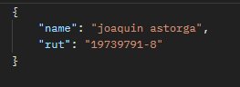
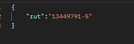
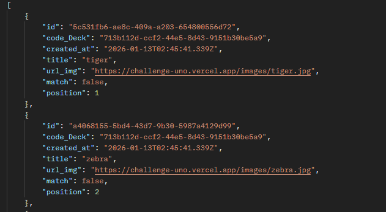
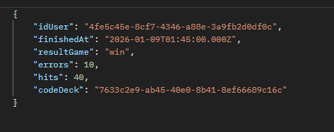

<p align="center">
  <a href="http://nestjs.com/" target="blank"></a>
  <a href="https://www.typescriptlang.org" target="blank"></a>
  <a href="https://www.postgresql.org" target="blank"></a>
</p>

# Proyecto Desafío - Uno - FullStack

## Configuraciones previas

1. Clonar proyecto usando la siguiente URL:
```
git clone https://github.com/JoaquinAAS97/uno-test-full-stack.git
```
2. Acceder a la ruta de la carpeta backend ```cd backend/``` y Ejecutar la instalacion de los node_modules:

```
npm install
```
3. clonar el archivo ```.env.template``` y renombrarlo a ```.env```

4. Cambiar las variables de entorno del archivo .env creado en el paso anterior.

5. Levantar la Base de datos
```
docker-compose up
```

6. Ejecutar la app de nest js:

```Con npm```
```
npm run start:dev
```
```Con yarn```
```
yarn start:dev
```

## STACK TECNOLÓGICO USADO

- Framework Nest.JS
- Type ORM
- Typescript (POO)
- PostresSQL


## Rutas de consultas:

- Para pruebas en  __postman__ | __insomnia__ | __cualquier otro cliente__ , ejecutar en orden los siguiente:


- Endpoint SEED-CARDS ```GET``` para obtener las URL de las imagenes y crear las cartas:
```
http://localhost:3001/api/desafio-uno/seed-cards/
```

## =================== POSTERIOR AL SEED-CARDS ======================================


- Endpoint users-create ```POST``` para crear usuario:
```
http://localhost:3001/api/desafio-uno/users
```
  __EJEMPLO DE ENVÍO DE DATOS__:




- Endpoint Login-User ```POST``` para login User:
```
http://localhost:3001/api/desafio-uno/users/login
```

  __EJEMPLO DE ENVÍO DE DATOS__:

  


- Endpoint Deck-cards  ```GET``` --> crea y entrega un mazo de cartas completamente virtual y barajado de forma aleatoria (Fisher-Yates):
```
http://localhost:3001/api/desafio-uno/deck-cards
```

__EJEMPLO DE Obtencion DE DATOS__:





- Endpoint Create-gameSession ```POST``` para registrar un juego:
```
http://localhost:3001/api/desafio-uno/game-session
```
__EJEMPLO DE ENVÍO DE DATOS__:

